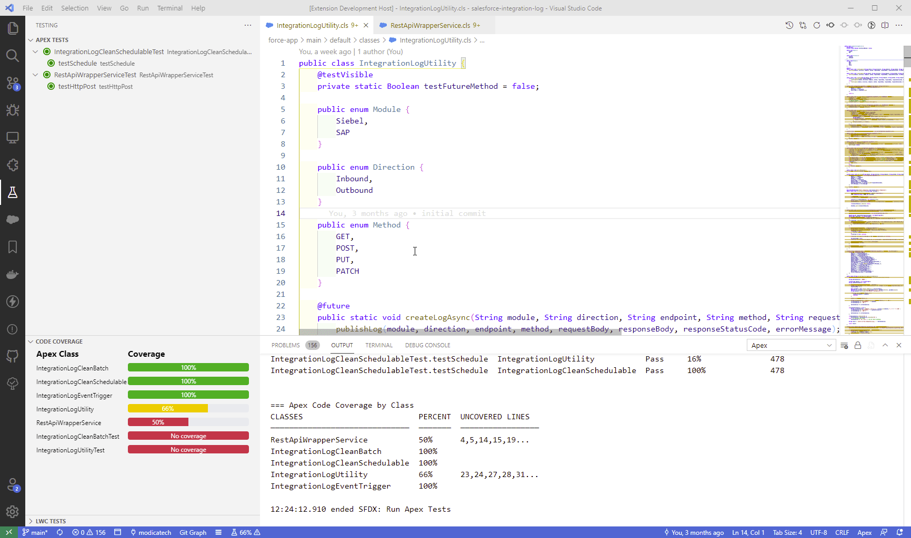
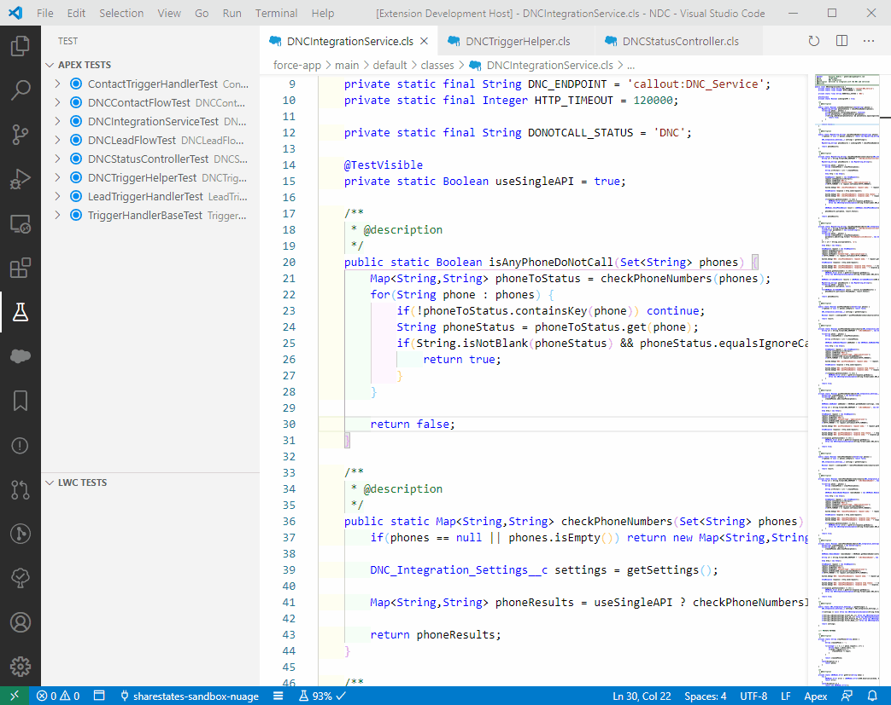
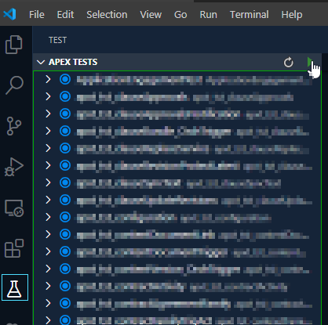

# Salesforce APEX Code Coverage Visualizer for Visual Studio Code

## Introduction

This extension shows a summary of the code coverage for all APEX classes in the current project. The extension relies on the official [Salesforce Extensions](https://marketplace.visualstudio.com/items?itemName=salesforce.salesforcedx-vscode) test runner which creates the necessary files used to show the code coverage.

It works with both Dark and Light themes

## Documentation

Make sure you have configured the preferences on the Salesforce extension to retrieve code coverage on test execution. To do this, go to Visual Studio Code menu *File->Preferences->Settings* and enter "coverage" in the search box, and then from the search results enable the **Retrieve-test-code-coverage** setting:

After that, just execute some tests as you normally would from the Test view:

Once the test coverage has been downloaded by the Salesforce CLI, you can now see the code coverage for a specific Apex file in the status bar, and also the overall code coverage in a new window:

#### Coverage in Status Bar

The indicator in the status bar will only appear if the Apex class has tests coverage downloaded for such class. You can see three indicators, depending on the coverage percentage:

|Coverage|Indicator|
|-|-|
|0% - 65%||
|65% - 75%||
|75% - 100%||

#### Coverage Window

You can get to this window by either clicking on the coverage indicator on the status bar, or by executing the **SFDX: Show Code Coverage** from the command palette:

## Bugs and Feedback

To report issues with Salesforce Extensions for VS Code, open a [bug on GitHub](https://github.com/gmodica/apex-code-coverage-visualizer/issues/new?template=Bug_report.md). If you would like to suggest a feature, create a [feature request on GitHub](https://github.com/gmodica/apex-code-coverage-visualizer/issues/new?template=Feature_request.md).

